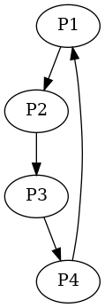

# **RPC-Based Deadlock Detection Using Probe Messages and DDFS**  

This project implements a **distributed deadlock detection** algorithm using **Remote Procedure Calls (RPCs)** in **Go**. It uses **probe messages** and **Distributed Depth-First Search (DDFS)** to identify circular wait conditions in a distributed system.  

## **Features**  
✅ **Fully distributed**: Each process runs independently, communicating via **RPC over TCP**.  
✅ **Probe-based detection**: Sends probe messages to track dependencies and detect cycles.  
✅ **Session-based tracking**: Unique session IDs ensure correct message processing.  
✅ **DDFS Optimization**: Prevents redundant messages by avoiding revisited nodes.  
✅ **Real-time logging**: Logs message flow, timestamps, and deadlock detection events.  

---

## **How It Works**  

1. Each process has a list of **neighbor processes** that it depends on.  
2. A process that suspects a deadlock **sends a probe** to its neighbors via **RPC**.  
3. The probe tracks visited nodes, forming a **wait-for graph**.  
4. If a probe **returns to the origin**, a **deadlock is detected**.  
5. The system logs the detected cycle and stops the probe propagation.  

---

## **Installation & Setup**  

### **1. Clone the repository**  
```bash
git clone https://github.com/sravs-01/deadlock-detection.git
cd deadlock-detection
```

### **2. Run the RPC servers (Processes)**  
Each process runs as an independent RPC server. Open **multiple terminals** and start each process separately.

For example, to run **Process 1**:  
```bash
go run main.go
```

Do this for each process in the topology.

### **3. Start Deadlock Detection**  
Once all servers are running, **trigger deadlock detection** by sending an initial probe from Process 1. This is done automatically in the `main.go` file.

---

## **Example Output**  

```log
[P1] Listening on port 8001...
[P2] Listening on port 8002...
[P3] Listening on port 8003...
[P4] Listening on port 8004...

[P1] Sending probe to P2: Visited [1]
[P2] Sending probe to P3: Visited [1, 2]
[P3] Sending probe to P4: Visited [1, 2, 3]
[P4] Sending probe to P1: Visited [1, 2, 3, 4]

[P1] Deadlock detected! Cycle: [1, 2, 3, 4]
```

This means that a **circular wait** was detected involving processes 1 → 2 → 3 → 4 → 1.

---

## **Topology Configuration**  
The **process topology** is defined in `main.go` under:  

```go
processes := map[int][]int{
    1: {2},
    2: {3},
    3: {4},
    4: {1}, // Creates a cycle
}
```
Modify this to **test different scenarios**.

---

### **Deadlock Graph Representation**  
The following diagram illustrates the process dependencies and potential deadlock cycle:



---

## **Future Improvements**  
🔹 **Dynamic process addition/removal**  
🔹 **Fault tolerance with retry mechanisms**  
🔹 **Optimized message passing with gRPC**  

---

## **License**  
This project is licensed under the **MIT License**.  